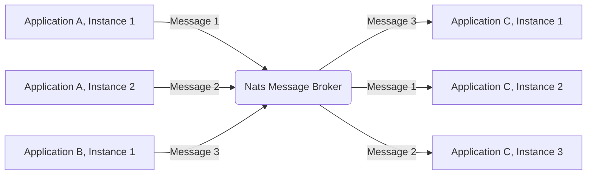
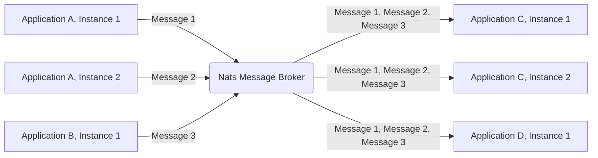

# CDS NATS

> support the [nats message broker](https://nats.io/) for CAP NodeJS runtime.

[](https://github.com/Soontao/cds-nats/actions/workflows/nodejs.yml)
[](https://github.com/Soontao/cds-nats/actions/workflows/nodejs-lint.yml)
[](https://codecov.io/gh/Soontao/cds-nats)

[](https://sonarcloud.io/summary/new_code?id=Soontao_cds-nats)
[](https://sonarcloud.io/summary/new_code?id=Soontao_cds-nats)
[](https://sonarcloud.io/summary/new_code?id=Soontao_cds-nats)

## Get Started

> install dependency

```bash
npm i -S cds-nats
```

> configure `package.json`

```json
{
  "cds": {
    "requires": {
      "messaging": {
        "kind": "nats"
      },
      "nats": {
        "impl": "cds-nats"
      }
    }
  }
}
```

> and ref the [Process Environment](https://cap.cloud.sap/docs/node.js/cds-env#process-env) document to configure the [`Nats Connection-Options`](https://github.com/nats-io/nats.js#Connection-Options)

```env
CDS_REQUIRES_NATS_SERVERS=127.0.0.1:4222
```

## Nats Messaging Service

> Use `Nats` as a message broker

### Queue and Subscription

Different from than the default behavior of [CAP Messaging Service](https://cap.cloud.sap/docs/node.js/messaging), `cds-nats` will prefer to listen event on `Queue Group` instead of general `Subscription`, because in micro-service architecture, in most case we need the `Queue/Consumer Group` each message only be consumed by single service instance.




Also, if you want to apply the `Publisher/Subscriber - Broadcast` pattern, just add the `@topic` annotation to the event (the `@queue` annotation is also supported).




```groovy
service PeopleService {

  // queue group event, producer/consumer exclusive consume
  // @queue: 'queueName' annotation is also supported
  event changeAmount {
    peopleID : UUID;
    amount   : Decimal;
  }

  // subscription event, publisher/subscriber broadcast consume
  @topic : 'test.app.srv.people.broadcast'
  event updateName {
    peopleID : UUID;
    Name     : String;
    Age      : Integer;
  }

  @topic : 'test.app.srv.people.broadcast'
  event updateAge {
    peopleID : UUID;
    Name     : String;
    Age      : Integer;
  }

}

```

### Options

TBD

## Nats KV Service

> Use `Nats` as a KV store

> This is an **experimental** feature of Nats, you MUST [enable the jetstream feature](https://docs.nats.io/nats-concepts/jetstream/js_walkthrough#prerequisite-enabling-jetstream) in nats server


<!-- 

@startuml
left to right direction
:Nats KV Store: -\-> (set value with key) 
:Nats KV Store: -\-> (set value with key and provider) 
:Nats KV Store: -\-> (list keys)
:Nats KV Store: -\-> (delete key)
@enduml

 -->

### Options

TBD

## Nats Lock Service

> Use `Nats` as a distributed lock service

> This is an **experimental** feature of Nats, you MUST [enable the jetstream feature](https://docs.nats.io/nats-concepts/jetstream/js_walkthrough#prerequisite-enabling-jetstream) in nats server

### Options

TBD

## Features

- [x] Nats Messaging Service
  - [x] Pub/Sub
    - [ ] complex test case
  - [x] Produce/Consume
    - [x] basic support and test case
  - [x] tenant aware
    - [x] `tenant` recover
    - [x] `user` recover
      - [x] `user-attr` recover
  - [ ] `messaging`
    - [ ] `srv.on`
    - [x] `srv.emit`
  - [ ] Outbox enable
  - [ ] Nats options documentation
- [x] Nats KV Store
  - [ ] tenant aware
  - [x] get
    - [x] get with provider
  - [x] set
  - [x] delete
  - [ ] Nats options documentation
- [x] Nats Distributed Lock Service
  - [ ] tenant aware
  - [x] 100 values test
  - [x] acquire timeout
  - [x] lock timeout (dead lock)
  - [x] synchronized method (high level API)
  - [ ] Nats options documentation
- [x] Nats RFC Service
  - [ ] tenant aware
  - [ ] OData Service query
  - [ ] OData Function/Action
  - [ ] Rest Adapter operation
  - [x] Error handler

## [LICENSE](./LICENSE)
