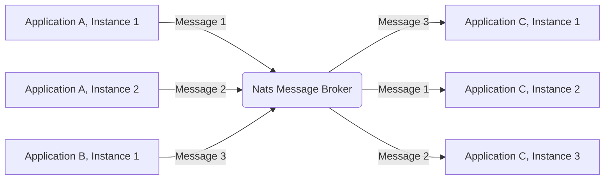
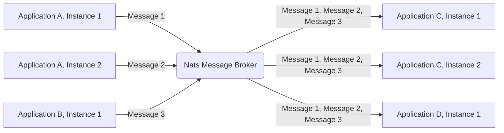
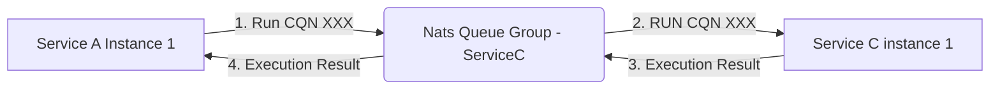

# CDS NATS

> support the [nats message broker](https://nats.io/) for CAP NodeJS runtime.

[](https://www.npmjs.com/package/cds-nats)
[](https://github.com/Soontao/cds-nats/actions/workflows/nodejs.yml)
[](https://github.com/Soontao/cds-nats/actions/workflows/nodejs-lint.yml)
[](https://codecov.io/gh/Soontao/cds-nats)

[](https://sonarcloud.io/summary/new_code?id=Soontao_cds-nats)
[](https://sonarcloud.io/summary/new_code?id=Soontao_cds-nats)
[](https://sonarcloud.io/summary/new_code?id=Soontao_cds-nats)

## Get Started

> install dependency

```bash
npm i -S cds-nats
```


> and ref the [Process Environment](https://cap.cloud.sap/docs/node.js/cds-env#process-env) document to configure the [`Nats Connection-Options`](https://github.com/nats-io/nats.js#Connection-Options)

```env
CDS_REQUIRES_NATS_SERVERS=127.0.0.1:4222
```

## Nats Messaging Service

> Use `Nats` as a message broker

### Queue and Subscription

Different from than the default behavior of [CAP Messaging Service](https://cap.cloud.sap/docs/node.js/messaging), `cds-nats` will prefer to listen event on `Queue Group` instead of general `Subscription`, because in micro-service architecture, in most case we need the `Queue/Consumer Group` each message only be consumed by single service instance.




Also, if you want to apply the `Publisher/Subscriber - Broadcast` pattern, just add the `@topic` annotation to the event (the `@queue` annotation is also supported).




```groovy
service PeopleService {

  // queue group event, producer/consumer exclusive consume
  // @queue: 'queueName' annotation is also supported
  event changeAmount {
    peopleID : UUID;
    amount   : Decimal;
  }

  // subscription event, publisher/subscriber broadcast consume
  @topic : 'test.app.srv.people.broadcast'
  event updateName {
    peopleID : UUID;
    Name     : String;
    Age      : Integer;
  }

  @topic : 'test.app.srv.people.broadcast'
  event updateAge {
    peopleID : UUID;
    Name     : String;
    Age      : Integer;
  }

}

```

### Options

TBD

```json
{
  "cds": {
    "requires": {
      "messaging": {
        "kind": "nats"
      },
      "nats": {
        "impl": "cds-nats"
      }
    }
  }
}
```

## Nats KV Service

> Use `Nats` as a KV store

> This is an **experimental** feature of Nats, you MUST [enable the jetstream feature](https://docs.nats.io/nats-concepts/jetstream/js_walkthrough#prerequisite-enabling-jetstream) in nats server


<!-- 

@startuml
left to right direction
:Nats KV Store: -\-> (set value with key) 
:Nats KV Store: -\-> (set value with key and provider) 
:Nats KV Store: -\-> (list keys)
:Nats KV Store: -\-> (delete key)
@enduml

 -->

### Options

> configure the `kv` service

```json
{
  "cds": {
    "requires": {
      "kv": {
        "kind": "nats-kv",
        "ttl": 100
      },
      "kv5000": {
        "kind": "nats-kv",
        "ttl": 5000
      },
      "nats-kv": {
        "impl": "cds-nats/lib/NatsKVService"
      }
    }
  }
}
```

- `ttl`, the maximum validity for each key, in milliseconds.

## Nats Distributed Lock Service

> Use `Nats` as a distributed lock service

> This is an **experimental** feature of Nats, you MUST [enable the jetstream feature](https://docs.nats.io/nats-concepts/jetstream/js_walkthrough#prerequisite-enabling-jetstream) in nats server


### Options

```json
{
  "cds": {
    "requires": {
      "lock": {
        "kind": "nats-lock",
        "check": {
          "interval": 10
        },
        "lock": {
          "acquire": 10000
        }
      },
      "nats-lock": {
        "impl": "cds-nats/lib/NatsLockService"
      }
    }
  }
}
```

- `check.interval`: `NatsLockService` check lock in polling mode, so this is the check interval
- `lock.acquire`: if the lock of target resource could be acquired immediately, `NatsLockService` will pending, if the target lock could not be acquired in specific timeout duration, `NatsLockService` will throw error to avoid to long time pending
- `lock.timeout`: the maximum timeout for single lock, if a resource is locked too long time, client will force acquire it, the defualt value is **1 HOUR**  

## Nats RFC Service

> Use `Nats` as a RFC communication tool

> To use the `NatsRFCService`, **MUST** enable Nats Messaging Service firstly





### Example

```js
const cds = cwdRequireCDS()
const { INSERT } = cds.ql
const messaging = await cds.connect.to("rfc") as NatsRFCService
const remoteApp = messaging.app("demo-app-micro-service");
const remotePeopleService = remoteApp.service("test.app.srv.theosun.PeopleService")
const newPeople = await remotePeopleService.run(
  INSERT.into("People").entries({ Name: cds.utils.uuid() })
)
expect(newPeople).not.toBeNull()
expect(newPeople.Name).not.toBeUndefined()
const updatedPeople = await remotePeopleService.updateWeight(newPeople.ID, 12.3)
expect(updatedPeople.Name).toBe(newPeople.Name)
expect(updatedPeople.Weight).toBe(12.3)

await expect(() => remotePeopleService.notExistFunction())
  .rejects
  .toThrow("method/action/function 'notExistFunction' is not existed on the service 'test.app.srv.theosun.PeopleService'")
```

### Options

```json
{
  "cds": {
    "requires": {
      "messaging": {
        "kind": "nats"
      },
      "rfc": {
        "kind": "nats-rfc",
        "app": {
          "name": "demo-app-micro-service"
        },
        "invoke": {
          "timeout": 180000
        }
      },
      "nats": {
        "impl": "cds-nats"
      },
      "nats-rfc": {
        "impl": "cds-nats/lib/NatsRFCService"
      }
    }
  }
}
```

- `app.name` - the app name of current application, its an identifier which will be used for RFC
- `app.timeout` - the timeout of each invocation, for example, if remote server do not respond result in 3 minutes, `NatsRFCService` will stop waiting and throw error

## Features

- [x] Nats Messaging Service
  - [x] Pub/Sub
    - [ ] complex test case
  - [x] Produce/Consume
    - [x] basic support and test case
  - [x] tenant aware
    - [x] `tenant` recover
    - [x] `user` recover
      - [x] `user-attr` recover
  - [ ] `messaging`
    - [ ] `srv.on`
    - [x] `srv.emit`
  - [ ] Outbox enable
  - [ ] Nats options documentation
- [x] Nats KV Store
  - [ ] tenant aware
  - [x] get
    - [x] get with provider
  - [x] set
  - [x] delete
  - [ ] Nats options documentation
- [x] Nats Distributed Lock Service
  - [ ] tenant aware
  - [x] 100 values test
  - [x] acquire timeout
  - [x] lock timeout (dead lock)
  - [x] synchronized method (high level API)
  - [ ] Nats options documentation
- [x] Nats RFC Service
  - [x] tenant aware
  - [x] OData Service query
  - [x] OData Unbounded Function/Action
  - [ ] Rest Adapter operation
  - [x] Error handler
  - [ ] Demo Micro Service

## [CHANGELOG](./CHANGELOG.md)

## [LICENSE](./LICENSE)
